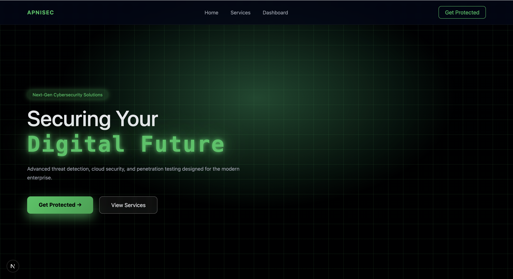
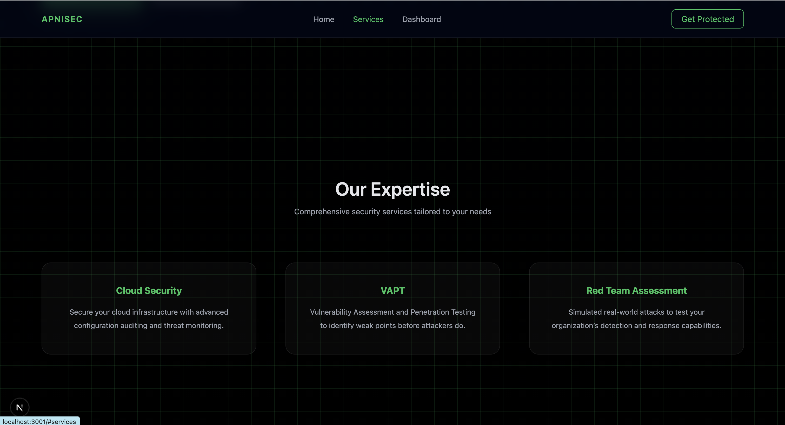
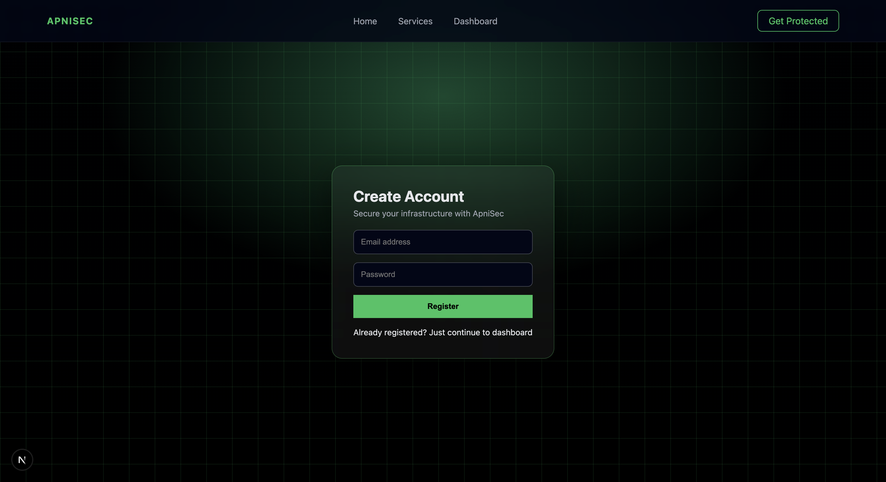
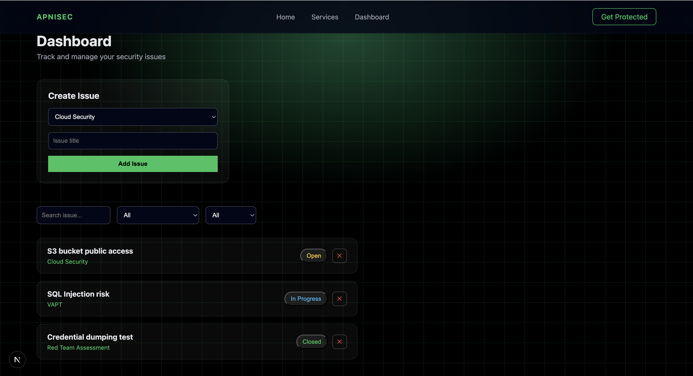

# ApniSec Security Issue Tracker – Documentation

## Overview
ApniSec Security Issue Tracker is a full-stack web application designed to manage and track cybersecurity issues such as Cloud Security risks, VAPT findings, and Red Team assessments.

## Tech Stack
Frontend:
- Next.js (App Router)
- TypeScript
- CSS (custom, no framework)
- React

Backend:
- Next.js API Routes
- Prisma ORM
- PostgreSQL (Supabase compatible)
- JWT Authentication
- OOP Architecture (Handlers, Services, Repositories)

## Features
- Custom authentication flow
- Protected dashboard
- Issue creation, filtering, and status management
- Modular backend architecture
- SEO-optimized landing page

## Authentication Design
For demonstration purposes, frontend authentication is implemented using token simulation.
Backend authentication APIs and JWT logic are implemented following OOP principles.

## Rate Limiting
Custom rate-limiting logic implemented at service level.

## Email Integration
Resend email service integrated in backend for notifications (registration, issue creation).

## Deployment
Frontend deployed on Vercel.
Backend code included for evaluation.

## Challenges
- Managing Next.js app router with backend APIs
- Handling deployment constraints
- Maintaining strict OOP backend structure

## Outcome
Delivered a production-style architecture with clean UI, scalable backend, and clear separation of concerns.

